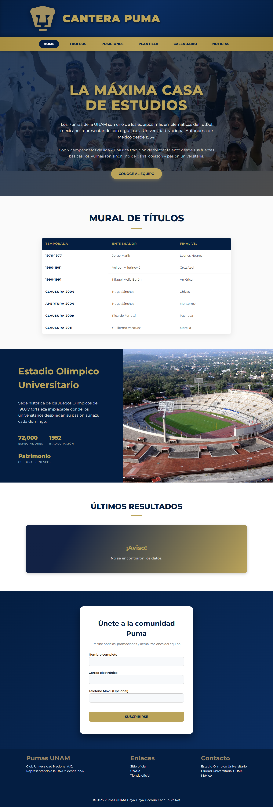
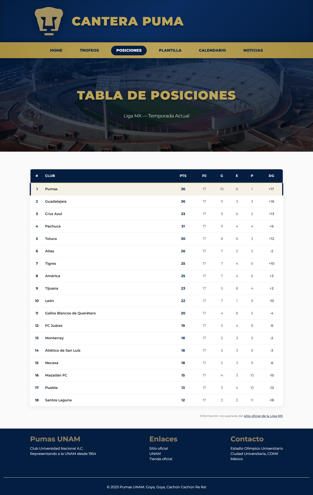
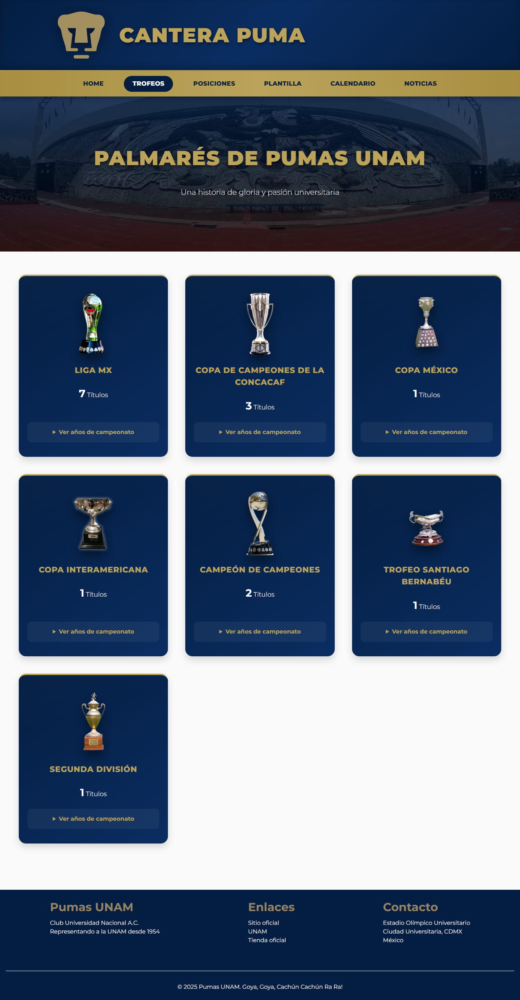
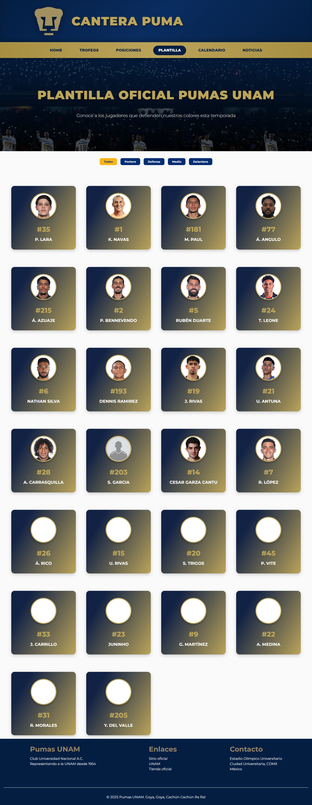
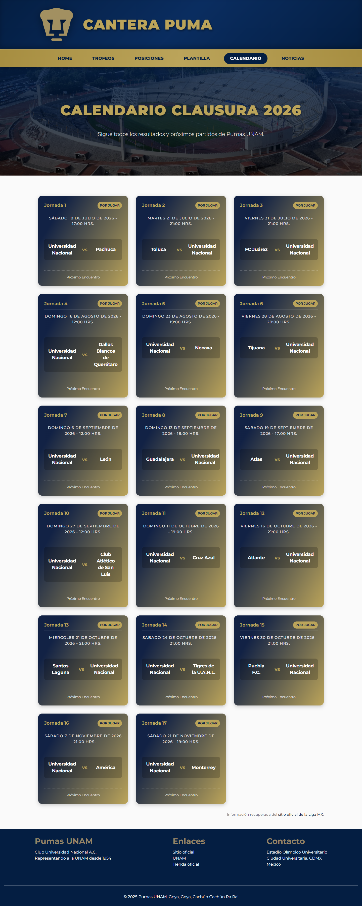
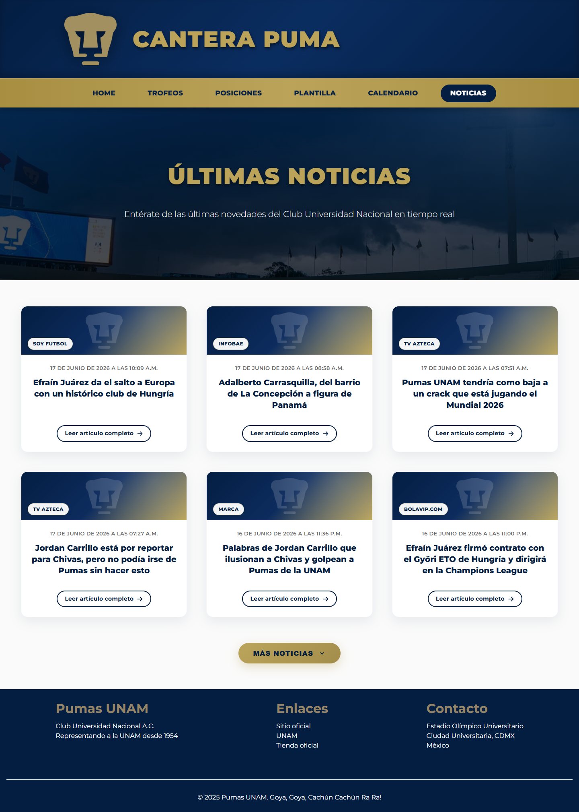

# 🦁 Cantera Puma - Portal Accesible de Pumas UNAM

Un portal web informativo e interactivo dedicado al Club Universidad Nacional (**Pumas de la UNAM**), desarrollado con un enfoque principal en la **Accesibilidad Web (A11y)**. 

Este proyecto fue creado como parte de la materia de **Accesibilidad** del 7.° semestre en la Facultad de la UNAM, con el fin de implementar las pautas **WCAG 2.1 / 2.2** para asegurar que cualquier usuario, incluyendo personas con discapacidad visual, motora o cognitiva, pueda navegar, consumir el contenido e interactuar con el sitio de manera óptima.

---

## 🌐 Enlace del Proyecto
El sitio está desplegado en Vercel y se puede visitar en:
👉 **[canterapuma.vercel.app](https://canterapuma.vercel.app)**

---

## ♿ Características Principales de Accesibilidad (A11y)

El portal ha sido desarrollado siguiendo estrictamente las directrices del **W3C (WAI-ARIA)** y las **WCAG**, aplicando las siguientes características avanzadas de accesibilidad:

1. **Estructura Semántica HTML5 Completa:**
   * Uso correcto de hitos (landmarks) como `<header>`, `<nav>`, `<main>`, `<section>`, y `<footer>` que facilitan la orientación y saltos rápidos con lectores de pantalla.
   * Jerarquía estricta de encabezados (`<h1>` a `<h3>`) para asegurar un mapa de navegación auditivo y visual coherente.

2. **Navegación del Menú por Teclado y Lector de Pantalla:**
   * El menú móvil utiliza atributos `aria-expanded` para comunicar visual y auditivamente si está abierto o cerrado, coordinado mediante `aria-controls` con la lista de navegación (`nav-list`).

3. **Modales Accesibles con Control de Foco (Focus Trap):**
   * Al abrirse un modal (como la confirmación del formulario de registro o los detalles de los jugadores), el foco se transfiere automáticamente al primer elemento interactivo.
   * Se restringe el foco dentro del modal (trap) para evitar que el usuario tabule de forma invisible en el fondo.
   * Cierre intuitivo mediante la tecla `Escape` (`ESC`) y click en el fondo del modal. Al cerrar, el foco vuelve al botón original que abrió el modal.

4. **Tablas de Datos Accesibles y Desplazamiento por Teclado:**
   * La tabla de posiciones utiliza `<caption>` descriptivo con la clase `.sr-only` para lectores de pantalla.
   * Encabezados (`<th>`) marcados con `scope="col"` y atributos `aria-label` detallados (ej. `aria-label="Partidos Jugados"` en lugar de solo leer "PJ").
   * Para asegurar que los usuarios que navegan únicamente con teclado puedan acceder a todo el contenido responsivo, el contenedor de la tabla incluye `role="region"`, `aria-label="Tabla del torneo"`, y `tabIndex="0"`, haciendo que la zona con scroll horizontal sea operable mediante las teclas de dirección.

5. **Formularios Robustos con Validación Accesible:**
   * Todos los inputs cuentan con etiquetas explícitas (`<label>`).
   * Validación en tiempo real con mensajes de error accesibles asociados.
   * Uso del atributo dinámico `aria-invalid="true"` para advertir al lector de pantalla que hay un error antes de enviar el formulario.

6. **Estilo y Diseño Visual de Alto Contraste:**
   * Utiliza la tipografía premium *Montserrat* en diferentes pesos para optimizar la legibilidad.
   * Gama de colores en azul profundo (`#122245`) y oro (`#bba45a`) que cumple y supera el contraste mínimo requerido para texto grande y regular.

---

## 🛠️ Tecnologías y Herramientas

* **Frontend:** React 19, React Router v7.
* **Estilos:** Vanilla CSS (Diseño responsivo, Grid, Flexbox y variables personalizadas de CSS para una estructuración limpia y escalable).
* **Servicios API (Backend Serverless):** Node.js localizados en `/api`. Realizan Web Scraping de datos actualizados y oficiales directamente de la Liga MX.
* **Entorno de Compilación y Servidor de Desarrollo:** Vite.
* **Plataforma de Despliegue:** Vercel.

---

## 📁 Estructura del Proyecto

A continuación se detalla la arquitectura de directorios del proyecto:

```text
pumas-page/
├── .vercel/              # Configuraciones internas de despliegue en Vercel
├── api/                  # Funciones Serverless de Node.js (Endpoints de scraping)
│   ├── futbol.js         # API de datos generales del fútbol
│   ├── ligamx.js         # API de datos complementarios de la liga
│   ├── news.js           # API de raspado de noticias de Pumas
│   └── posiciones.js     # API de posiciones del torneo Liga MX
├── public/               # Archivos públicos estáticos (Logotipos, favicon, etc.)
├── screenshots/          # Capturas de pantalla para la documentación
├── src/                  # Código fuente de la aplicación React
│   ├── assets/           # Imágenes y recursos locales (como banners y fotos fijas)
│   ├── components/       # Componentes reutilizables e individuales
│   │   ├── Campeonatos/  # Tarjetas y listado de campeonatos ganados
│   │   ├── Estadio/      # Sección informativa sobre el Estadio Olímpico Universitario
│   │   ├── Form/         # Formulario de suscripción accesible
│   │   ├── NavBar/       # Barra de navegación accesible
│   │   ├── StandingsTable/ # Tabla responsiva y navegable por teclado
│   │   └── ...           # Otros componentes funcionales (Modal, Loader, etc.)
│   ├── hooks/            # Hooks de React para conectar las llamadas a los endpoints locales
│   │   ├── usePosiciones.js
│   │   ├── useCalendario.js
│   │   └── ...
│   ├── pages/            # Vistas principales/páginas de la aplicación
│   │   ├── HomePage      # Página principal
│   │   ├── TrophiesPage  # Página de trofeos y campeonatos
│   │   ├── PlayersPage   # Plantilla de jugadores
│   │   ├── StandingsPage # Tabla de posiciones en vivo
│   │   ├── CalendarioPage# Próximos encuentros y resultados pasados
│   │   └── NewsPage      # Últimas noticias y videos destacados
│   ├── utils/            # Funciones de utilidad auxiliares
│   ├── App.jsx           # Enrutamiento y esqueleto de la SPA
│   ├── index.css         # Estilos globales y tokens de diseño
│   ├── main.jsx          # Inicializador de React
│   └── ModalContext.jsx  # Contexto global para la gestión accesible de modales
├── index.html            # Plantilla HTML base del proyecto en Español (lang="es")
├── vite.config.js        # Configuración del empaquetador Vite
├── package.json          # Listado de dependencias y scripts del proyecto
└── pnpm-lock.yaml        # Lockfile de dependencias de pnpm
```

## 📸 Capturas de Pantalla

A continuación se presentan capturas del portal tomadas directamente desde la versión en vivo:

### 1. Página de Inicio (Home)
Sección principal que introduce al usuario a la historia de Pumas, presenta el Estadio Olímpico Universitario y cuenta con el formulario accesible de registro.


### 2. Tabla de Posiciones (Standings)
Tabla con las posiciones actuales del torneo de la Liga MX, diseñada con marcado accesible y scroll operable por teclado.


### 3. Palmarés e Historia (Trofeos)
Sección interactiva que repasa las ligas, copas y campeonatos del Club Universidad Nacional.


### 4. Plantilla del Primer Equipo (Jugadores)
Visualización accesible de la plantilla actual de jugadores con filtros dinámicos y fichas de detalle accesibles.


### 5. Calendario y Resultados
Lista de encuentros del torneo actual y resultados más recientes del equipo.


### 6. Noticias y Videos
Últimas noticias sobre Pumas.

